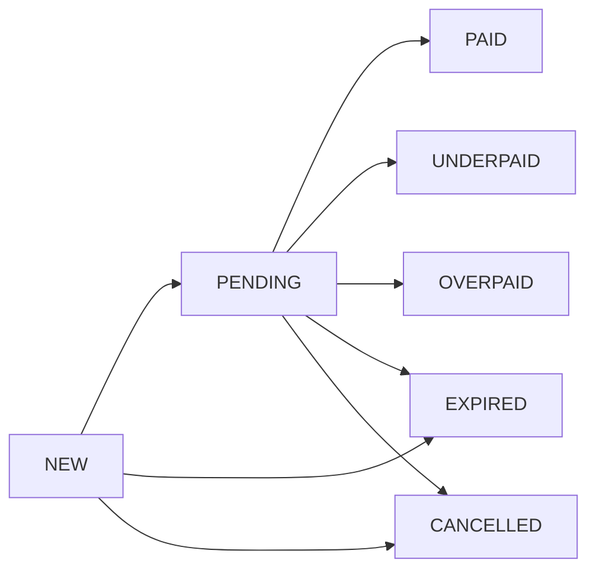

# 💳 Payment Platform

> Платформа для приёма платежей за онлайн-услуги

[](https://www.python.org/)
[](https://www.djangoproject.com/)
[](https://www.postgresql.org/)
[](https://fastapi.tiangolo.com/)

---

## 📋 Оглавление

- [🚀 Быстрый старт](#-быстрый-старт)
- [📡 API Endpoints](#-api-endpoints)
- [🔐 Аутентификация](#-аутентификация)
- [💰 Бизнес-логика](#-бизнес-логика)
- [📊 Отчёты](#-отчёты)
- [📨 Уведомления](#-уведомления)
- [🧪 Тесты](#-тесты)
- [🏗️ Архитектура](#️-архитектура)
- [📝 Допущения](#-допущения)
- [🔧 Бонус (FastAPI)](#-бонус-fastapi)
- [🐛 Что не сделано](#-что-не-сделано)

---

## 🚀 Быстрый старт

### Локальный запуск

```bash
# Клонируйте репозиторий
git clone https://github.com/haermaeusmora/payment_platform_tz
cd testforitworld

# Создайте и активируйте виртуальное окружение
python -m venv venv
venv\Scripts\activate        # Windows
source venv/bin/activate      # Linux/Mac

# Установите зависимости
pip install -r requirements.txt

# Примените миграции
python manage.py migrate

# Создайте суперпользователя
python manage.py createsuperuser

# Запустите сервер
python manage.py runserver
```

### Через Docker

```bash
docker-compose up --build
```

---

## 📡 API Endpoints

| Метод | Путь | Описание |
|-------|------|----------|
| `POST` | `/api/v1/invoices/` | Создать счёт |
| `GET` | `/api/v1/invoices/{id}/` | Детали счёта |
| `POST` | `/api/v1/invoices/{id}/cancel/` | Отменить счёт |
| `POST` | `/internal/payments/` | Зафиксировать поступление |
| `GET` | `/api/v1/merchants/{id}/balance/` | Баланс мерчанта |
| `GET` | `/api/v1/merchants/{id}/report/` | Отчёт |

---

## 🔐 Аутентификация

| Тип | Заголовок | Описание |
|-----|-----------|----------|
| **Публичные** | `X-Api-Key` | Для всех API эндпоинтов |
| **Внутренние** | `X-Internal-Key` | Для `/internal/payments/` |

---

## 💰 Бизнес-логика

### Комиссия
- **1%** от суммы платежа
- Минимум **0.50** в валюте счёта
- Фиксируется отдельной проводкой в `LedgerEntry`

### Статусы счёта



| Статус | Описание |
|--------|----------|
| `new` | Счёт создан |
| `pending` | Частично оплачен |
| `paid` | Полностью оплачен |
| `underpaid` | Недоплата (срок истёк) |
| `overpaid` | Переплата > 1% |
| `expired` | Срок истёк |
| `cancelled` | Отменён мерчантом |

### Идемпотентность
- Счета: по `external_id` в рамках проекта
- Платежи: по `provider_transaction_id`

---

## 📊 Отчёты

```bash
GET /api/v1/merchants/{id}/report/?date_from=2026-08-01&date_to=2026-08-31&group_by=day
```

**Параметры:**
- `date_from` — дата начала (YYYY-MM-DD)
- `date_to` — дата конца (YYYY-MM-DD)
- `group_by` — `day` или `project`

**Метрики:**
- Количество выставленных счетов
- Количество оплаченных
- Сумма выставленная
- Сумма фактически полученная
- Сумма удержанной комиссии
- Конверсия в оплату (%)

---

## 📨 Уведомления

Уведомления отправляются на URL мерчанта с **HMAC-SHA256** подписью.

### Статусы уведомлений

| Статус | Описание |
|--------|----------|
| `pending` | Ожидает отправки |
| `sent` | Успешно отправлено |
| `failed` | Ошибка отправки |
| `retry` | Будет повторная попытка |
| `expired` | Попытки исчерпаны |

### Повторные попытки

| Попытка | Задержка |
|---------|----------|
| 1 | 5 минут |
| 2 | 10 минут |
| 3 | 20 минут |
| 4 | 40 минут |
| 5 | 80 минут |

**Максимум:** 5 попыток

### Команды

```bash
# Отправить уведомления
python manage.py send_notifications

# Просрочить счета
python manage.py expire_invoices
```

---

## 🧪 Тесты

```bash
# Запустить все тесты
python manage.py test apps.core.tests -v 2

# Запустить конкретный тест
python manage.py test apps.core.tests.test_complex_logic
```

**Покрытие:**
- ✅ Полная оплата
- ✅ Частичная оплата
- ✅ Переплата
- ✅ Конвертация валют
- ✅ Комиссия (включая минимальную)
- ✅ Идемпотентность
- ✅ Одновременные платежи (гонки)
- ✅ Повторные попытки уведомлений
- ✅ Баланс из проводок

---

## 🏗️ Архитектура

### Технологии

| Компонент | Технология |
|-----------|------------|
| **Backend** | Django 4.2 |
| **База данных** | PostgreSQL / SQLite |
| **API** | Django Views (без DRF) |
| **Валюты** | FastAPI (бонус) |
| **Уведомления** | Management-команды |

### Структура проекта

```
apps/core/
├── models.py          # Модели данных
├── services/          # Бизнес-логика
│   ├── payment_service.py
│   ├── invoice_service.py
│   ├── balance_service.py
│   ├── notification_service.py
│   └── rate_client.py
├── views/             # HTTP-эндпоинты
├── management/        # Команды
│   └── commands/
│       ├── expire_invoices.py
│       └── send_notifications.py
└── tests/             # Тесты
    ├── test_payment_flow.py
    └── test_complex_logic.py
```

---

## 📝 Допущения

1. **Комиссия**: 1% от суммы, минимум 0.50 в валюте счёта
2. **Переплата**: порог > 1% от суммы счёта → `overpaid`
3. **Валюты**: конвертация по курсу на момент платежа
4. **Уведомления**: асинхронные через management-команду
5. **Баланс**: рассчитывается из проводок (`LedgerEntry`)

---

## 🔧 Бонус: FastAPI

Отдельный микросервис для курсов валют с кэшированием.

### Запуск

```bash
cd rates_service
pip install -r requirements.txt
python main.py
```

### Эндпоинты

| Метод | Путь | Описание |
|-------|------|----------|
| `GET` | `/rates/{from}/{to}` | Курс пары |
| `GET` | `/rates/health` | Проверка здоровья |
| `GET` | `/rates/bulk` | Массовые курсы |
| `POST` | `/rates/cache/clear` | Очистка кэша |

### Особенности

- ✅ **Кэширование** (TTL: 60 сек)
- ✅ **Таймауты** (5 сек)
- ✅ **Fallback** при недоступности
- ✅ **Health check**

---

## 🐛 Что не сделано

- ⏳ Celery для асинхронных уведомлений (есть management-команда)
- ⏳ Нагрузочное тестирование
- ⏳ Подробное логирование
- ⏳ Swagger/OpenAPI документация
- ⏳ Мониторинг (Prometheus + Grafana)

---

## 💡 Что бы доделал

1. **Celery** — асинхронная обработка уведомлений
2. **Redis** — кэширование курсов валют
3. **CI/CD** — автоматическое тестирование и деплой
4. **Prometheus + Grafana** — мониторинг
5. **Swagger** — автоматическая документация API

---
